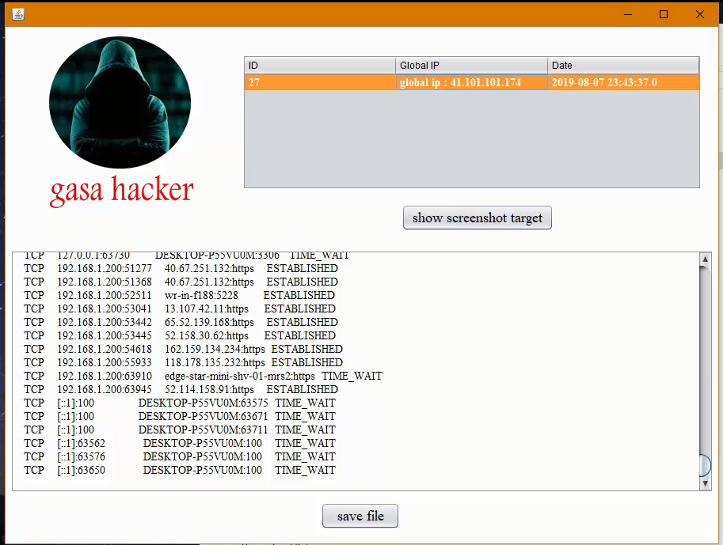

# Build an advanced malicious program using java language for windows and linux platform

we will try to hide a malicious code into legal program.
# screenshot

this legal program has this features :

- beautiful design with graphical user interface.
- solve second degree equation.
- do all the operation(addition, subtraction , division and multiplication element by element) between two matrix.
- executed in any operation system platform .
- contains a malicious code without any suspect things.
- store data target into database without any suspect from target.
- interacts with the command shell
